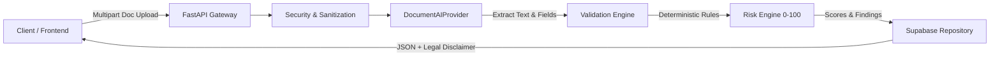

# PropZen GlobalVerificationEngine

> **Production-Ready AI-Assisted Real Estate Document Verification Backend**  
> Autonomous verification engine for property sale deeds, registry instruments, khatauni land records, tax certificates, and encumbrance records with deterministic validation, cross-document correlation, and explainable risk scoring.

---

## Architecture & Verification Pipeline



---

## 1. Python Environment Setup

The PropZen GlobalVerificationEngine requires **Python 3.10+** (Python 3.11 recommended).

Check Python on your machine:
```powershell
python --version
```

If Python is not installed or you prefer an isolated runtime:
- **Using Astral uv (Fastest):**
  ```powershell
  winget install astral-sh.uv --scope user -e
  uv python install 3.11
  ```
- **Using Official Python Installer:**
  Download and install from [python.org/downloads](https://www.python.org/downloads/) (ensure **"Add Python to PATH"** is selected).

---

## 2. Virtual Environment Creation

Navigate to the project root or verification engine directory:

```powershell
# From the PropZen root:
cd c:\Users\Sakshi\Desktop\PropZen\backend\verification_engine

# Using uv (instantaneous):
uv venv .venv --python 3.11

# OR using standard python venv:
python -m venv .venv
```

Activate the virtual environment:
- **Windows (PowerShell):**
  ```powershell
  .\.venv\Scripts\Activate.ps1
  ```
- **Windows (Command Prompt):**
  ```cmd
  .\.venv\Scripts\activate.bat
  ```
- **macOS / Linux:**
  ```bash
  source .venv/bin/activate
  ```

---

## 3. Dependency Installation

With your virtual environment activated, install all required packages:

```powershell
# Using uv pip:
uv pip install -r requirements.txt

# OR using standard pip:
pip install -r requirements.txt
```

Core packages installed:
- `fastapi` & `uvicorn` (Async REST API runtime)
- `pydantic` & `pydantic-settings` (Strict schema validation)
- `supabase` & `postgrest` (PostgreSQL client)
- `python-multipart` (Secure file uploads)
- `httpx` (Async HTTP client for external AI providers)
- `pypdf` & `pillow` (Document & image processing)
- `pytest` & `pytest-asyncio` (Automated testing suite)

---

## 4. Environment Variables Configuration

Copy the sample environment file:
```powershell
cp .env.example .env
```

Key environment configuration variables:

| Variable | Default | Purpose |
| :--- | :--- | :--- |
| `VERIFICATION_HOST` | `0.0.0.0` | IP binding for microservice |
| `VERIFICATION_PORT` | `8000` | Port for verification service |
| `ENVIRONMENT` | `development` | Environment mode (`development` / `production`) |
| `API_KEY_SECRET` | `PropZen_Verification_SecKey_2026` | Service API Key for gateway authorization |
| `MAX_FILE_SIZE_MB` | `10` | Maximum upload size constraint |
| `AI_PROVIDER` | `synthetic` | Provider: `synthetic`, `gemini`, or `openai` |
| `GEMINI_API_KEY` | *(optional)* | Google Gemini Vision API key |
| `OPENAI_API_KEY` | *(optional)* | OpenAI GPT-4o API key |
| `SUPABASE_URL` | `https://eemxylswyvhsyzllcsnp.supabase.co` | Supabase project URL |
| `SUPABASE_SERVICE_ROLE_KEY` | *(optional)* | Supabase Service Role key |
| `ENABLE_MOCK_REPO` | `true` | `true` for offline/mock store, `false` for live Supabase |

---

## 5. Supabase Configuration

1. Log in to your [Supabase Dashboard](https://app.supabase.com).
2. Select your PropZen project (`eemxylswyvhsyzllcsnp`).
3. Under **Project Settings** -> **API**, copy:
   - **Project URL** -> `SUPABASE_URL`
   - **anon public key** -> `SUPABASE_ANON_KEY`
   - **service_role secret** -> `SUPABASE_SERVICE_ROLE_KEY`
4. Set `ENABLE_MOCK_REPO=false` in `.env` to enable live database persistence.

---

## 6. Database Migration

Apply the verification schema to your Supabase PostgreSQL instance:

1. In the Supabase Dashboard, navigate to the **SQL Editor**.
2. Open the migration file:
   - Located at: `supabase_verification_engine.sql` (or `backend/verification_engine/schema.sql`).
3. Paste the contents into the SQL Editor and click **Run**.

The migration sets up:
- `verification_cases`: Core case record with risk score and status.
- `verification_documents`: Metadata and storage pointer for uploaded deeds.
- `extracted_fields`: Granular extracted property, ownership, and transaction attributes.
- `verification_findings`: Explanations of discrepancies, severity, and evidence.
- `verification_audit_logs`: Compliance-grade event log masking raw PII.
- Row Level Security (RLS) policies and performance indexes.

---

## 7. Starting FastAPI

Start the verification microservice with Uvicorn:

```powershell
# From the backend/verification_engine directory:
uvicorn main:app --host 0.0.0.0 --port 8000 --reload

# OR from PropZen workspace root:
python -m uvicorn backend.verification_engine.main:app --host 0.0.0.0 --port 8000 --reload
```

The service will boot:
```
INFO:     Started server process
INFO:     Uvicorn running on http://0.0.0.0:8000 (Press CTRL+C to quit)
```

Verify service health:
```powershell
curl http://localhost:8000/api/v1/verification/health
```

---

## 8. Running Tests

Run the full automated pytest suite covering all 10 required verification scenarios:

```powershell
# Run from backend/verification_engine:
pytest tests/ -v

# Or run using specific venv python from workspace root:
.\backend\verification_engine\.venv\Scripts\python.exe -m pytest backend/verification_engine/tests -v
```

### Covered Test Scenarios:
1. `test_successful_document_upload`: Case creation and multipart file upload.
2. `test_invalid_file_type`: Rejection of unauthorized file formats (`.exe`, `.sh`).
3. `test_oversized_file`: Enforcing the 10MB limit with HTTP 413.
4. `test_missing_field`: Verifies missing values return `null` and are not hallucinated.
5. `test_matching_documents`: Cross-checking matching Sale Deed and Khatauni (PASS).
6. `test_mismatching_property_area`: Detecting area conflict (1250 sq ft vs 850 sq ft).
7. `test_mismatching_owner_name`: Identifying ownership discrepancies across records.
8. `test_invalid_date_relationship`: Flagging execution date after registration date.
9. `test_high_risk_result`: Cumulative risk scoring and HIGH_RISK status.
10. `test_insufficient_data`: Handling degraded/unreadable documents gracefully.

---

## 9. Testing API using Swagger UI

Navigate to the interactive OpenAPI Swagger docs in any browser:
👉 **[http://localhost:8000/docs](http://localhost:8000/docs)**

### Standard Flow in Swagger:
1. **`POST /api/v1/verification/cases`**
   - Create a case:
     ```json
     {
       "user_id": "usr_9982",
       "property_id": "prop_lotus_blvd",
       "document_type": "SALE_DEED"
     }
     ```
   - Copy the returned `case_id`.
2. **`POST /api/v1/verification/cases/{case_id}/documents`**
   - Upload `backend/verification_engine/tests/test_data/valid_sale_deed.txt`.
3. **`POST /api/v1/verification/cases/{case_id}/analyze`**
   - Triggers extraction, consistency validation, and risk analysis.
   - Inspect the returned risk score, extracted fields, findings, and disclaimer.

---

## 10. How to Connect the Existing PropZen Frontend

The frontend integration layer is completely decoupled from existing UI templates.

### A. Using the JavaScript Client
Include `propzen_verification_client.js`:

```html
<script src="/backend/verification_engine/frontend_integration/propzen_verification_client.js"></script>
<script>
  const verifier = new PropZenVerificationClient({
    baseUrl: 'http://localhost:8000',
    apiKey: 'PropZen_Verification_SecKey_2026'
  });

  async function verifyPropertyDocument(file) {
    // 1. Create verification case
    const newCase = await verifier.createCase({
      userId: 'current_propzen_user_id',
      documentType: 'SALE_DEED'
    });

    // 2. Upload file
    await verifier.uploadDocument(newCase.case_id, file, 'SALE_DEED');

    // 3. Analyze
    const report = await verifier.analyzeCase(newCase.case_id);
    console.log("Verification Status:", report.status);
    console.log("Risk Score:", report.risk_score);
    console.log("Findings:", report.findings);
    return report;
  }
</script>
```

### B. Embedding the Ready-to-Use UI Widget
Open or iframe the reference interface:
👉 `backend/verification_engine/frontend_integration/verification_widget.html`

It demonstrates:
- **Document Uploaded & Type badge**
- **Extraction Confidence indicator**
- **Verification Status badge** (`PASS`, `REVIEW_REQUIRED`, `HIGH_RISK`, `INSUFFICIENT_DATA`)
- **Transparent 0–100 Risk Score Meter**
- **Detected Information table**
- **Potential Issues & Detailed Evidence box**
- **Recommended Action**
- **Mandatory AI Verification Legal Disclaimer**

---

## Legal & Compliance Notice

> [!IMPORTANT]
> **AI-Assisted Verification Notice**: The results produced by the PropZen GlobalVerificationEngine are generated by automated artificial intelligence algorithms for preliminary risk assessment only. They do NOT constitute a legal title certification, government registry guarantee, or financial underwriting warrant. All transactions must be accompanied by certified manual searches conducted through the relevant Sub-Registrar Office.
